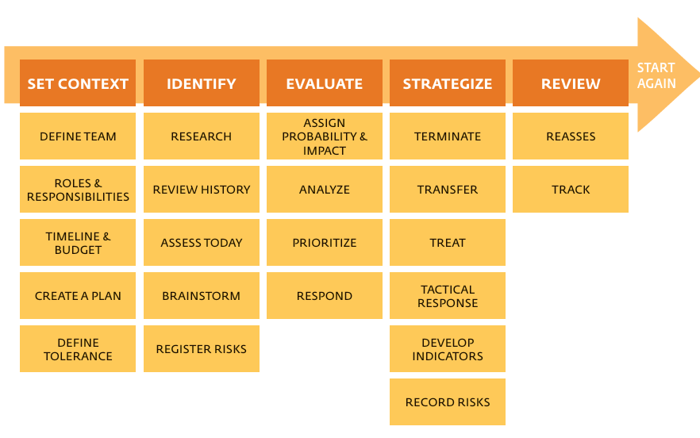

# Framework

1. **Set Context**: Establish the framework for risk management, including team, roles, timeline, budget, and risk tolerance.

2. **Identify**: Research risks, review historical data, assess current conditions, brainstorm potential risks, and register them.

3. **Evaluate**: Assign probability and impact to each risk, analyze and prioritize them, and determine a response strategy.

4. **Strategize**: Decide on risk treatment - whether to terminate, transfer, or treat the risk, and outline tactical responses and indicators.

5. **Review**: Reassess and track the risks and the effectiveness of the risk management strategies, record any changes, and prepare to start the process again.

## Creation of a Plan 

Creating a plan for developing a risk management framework involves several key components as outlined in the image:

1. **Process**: Define the procedure to develop and integrate the risk management framework into the business.

2. **Outline**: Develop a comprehensive outline for the risk management framework. A detailed checklist for this can often be found in the same text or document.

3. **Methodology**: Detail the qualitative and quantitative means for risk assessment, analysis, ranking, and the inclusion in a risk register. Also, describe how the organization will handle risks, whether by terminating, tolerating, or transferring them.

4. **Definitions**: Establish a common language for the team by agreeing on the definitions of terms related to risk management.

5. **Templates**: Agree on templates that will be used throughout the framework's development. These templates should include tools for risk identification, analysis, evaluation, and the risk management framework itself.