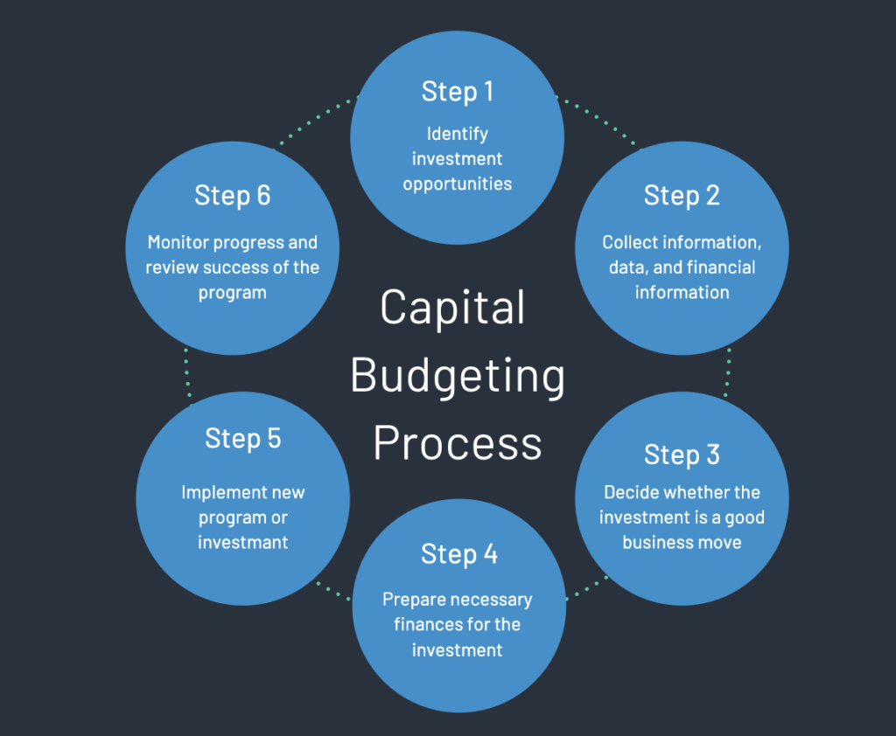

# Capital Budgeting Process

Capital budgeting is a crucial financial management process that companies undertake to evaluate potential major investments or expenditures. The process helps in decision-making over long-term investments. Here's a detailed explanation of each step:

1. **Initiation and Idea Generation:**
   - This is the first step where the need for investment is recognized. Investment ideas can come from various sources within an organization, including top management, department heads, or the operational staff. 
   - The ideas can be related to new projects, expansion of existing operations, equipment upgrading, or replacement of obsolete facilities.
   - The goal here is to compile a list of potential projects that could contribute to the company's strategic objectives.

2. **Investment Analysis:**
   - Once potential investments are identified, the next step is to analyze their viability.
   - **Forecasting Costs and Benefits:** This involves estimating the initial outlay required for the investment and the subsequent costs and benefits that will arise over the project's life. This could include operational costs, maintenance, and projected revenues or savings.
   - **Evaluating Costs and Benefits:** This is done using various capital budgeting techniques such as Net Present Value (NPV), Internal Rate of Return (IRR), Payback Period, and Profitability Index (PI). These techniques take into account the time value of money, helping to determine the value today of future cash flows.

3. **Investment Appraisal and Selection:**
   - In this step, each investment's financial performance is evaluated and compared. This involves using the calculated financial indicators (NPV, IRR, etc.) to assess the potential return against the company's required rate of return or hurdle rate.
   - Investments are ranked based on these indicators, and the best ones are selected for implementation. The selection also considers how well the investment aligns with the strategic goals of the company and the available resources.

4. **Implementation:**
   - Once an investment is selected, the project moves into the implementation phase. 
   - This involves allocating resources, scheduling, and executing the project according to the plan. 
   - It may also involve securing financing, purchasing assets, hiring personnel, and conducting training as needed for the operation of the new investment.

5. **Monitoring and Follow-up:**
   - The final step is the ongoing process of monitoring the investment to ensure that it meets or exceeds the expected performance criteria.
   - Regularly reviewing the project's output, costs, and revenues ensures that it is on track.
   - If the investment is not performing as expected, corrective actions are taken. This could involve additional investment, modification of the project scope, or even divestiture in some cases.

Throughout this process, it's important that each step is carried out with due diligence, as the decisions made can significantly affect the company's financial future. Effective communication, realistic forecasting, and careful analysis are key components of successful capital budgeting.