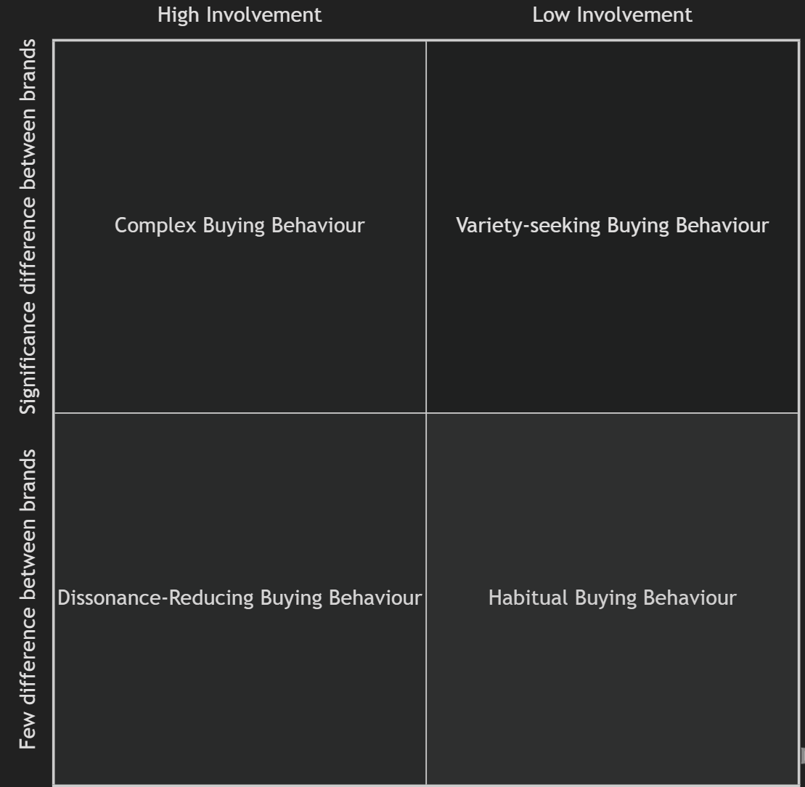

# Types of Buying Decision Behaviour

{ width=50%,align=center}

There are four types of buying decision behavior:

1. **Complex Buying Behavior**:

   Complex buying behavior occurs when consumers face a high level of involvement in the purchase decision and encounter significant differences among available options. This type of behavior is commonly observed when consumers are purchasing expensive, risky, infrequently purchased, and highly self-expressive products, such as a house, a car, or a computer. The decision-making process is extensive and involves thorough research, evaluation of alternatives, and consideration of multiple factors, such as price, quality, features, and brand reputation. Consumers engage in information gathering, consult expert opinions, and rely on personal experiences to make informed decisions.

   For example, suppose a consumer wants to buy a new laptop. He would likely spend time researching different brands, comparing specifications/features, reading customer reviews, and seeking recommendations from friends or technology experts before finalizing their purchase.

   Simply put, in complex buying behaviour, the consumer will go through different learning phases. Firstly, he will learn and develop a belief regarding the product that he wants to purchase. The belief of the consumer creates his attitude based on which he will make the final purchase decision. Therefore, the marketers of the high involvement products must ensure that they understand the information-gathering and evaluation behaviour of these customers and help them learn about the attributes of the product along with their relative importance. They can also take the help of advertisements so the customers can get answers to basic questions. 

2. **Dissonance-Reducing Buying Behavior**:

   Dissonance-Reducing Buying Behavior occurs when consumers face a high level of involvement in the purchase decision but encounter little difference among brands. This type of behavior is commonly observed when consumers are purchasing expensive, infrequent, or risky products; such as furniture, curtain material, or sofa covers/upholstery. These products face high involvement of the consumer as they are expensive and self-expressive. Also, as the perceived brand difference is not large in this case, the consumers would purchase easily and readily available products.

   For example, suppose a consumer wants to buy a portable tent for camping. For this, he will have to make a quick decision from the limited options available to him. He will make the purchase decision without doing enough research and inquiring about information from different sources about it.

   Once the purchase is made, the consumers might experience post-purchase dissonance or after-sale discomfort. It happens when the consumer notices some disadvantages of the purchased brand or hears some good things about the other brand. For such dissonance, it is essential for the marketer to provide the consumers with after-sale communications and help them feel good about their brand choices.

3. **Habitual Buying Behavior**:

   Habitual Buying Behavior occurs when consumers face a low level of involvement in the purchase decision along with little significant brand differences. This type of behavior is commonly observed when consumers are purchasing products like salt, etc. Low involvement of consumers means that they simply reach the store and go for a brand to buy a product. If the consumer is buying a product from the same brand, it does not mean that they are loyal to the brand. It just means that the consumer is buying the product out of habit.

   For example, buying a specific brand of toothpaste, snack items, or toiletries from a particular store without much thought or consideration falls under habitual buying behavior. Consumers may choose these products based on familiarity, past positive experiences, or simply because it is part of their routine.

   The consumer behavior, in this case, does not pass through the usual belief attitude behavior sequence. Before purchasing a product, these consumers do not extensively search for information regarding the brand, evaluate the characteristics of the brand, and make weighty decisions on which brand to purchase. Instead, they just passively receive the information while watching television or reading newspapers or magazines. Also, Ad repetitions instead of creating brand conviction, create brand familiarity in the minds of consumers. Because of this, consumers do not form strong attitudes towards a brand; they just select the brand because they are familiar with it. Therefore, the marketers take help of repetitive marketing campaigns, so that consumers can remember their brand.

4. **Variety-Seeking Buying Behavior**:

   Variety-Seeking Buying Behavior occurs when consumers exhibit a desire for new experiences, change, and novelty in their purchases. It means that when consumers face a low level of involvement but significant perceived brand differences, they undertake variety-seeking buying behavior. In such cases, the consumers switch brands more often.

   For example, a consumer chooses a namkeen brand without doing much evaluation, and then after consuming the product, evaluates it. But the consumer might pick another brand when making a purchase the next time. The reason behind this can be his urge to try something new or just out of boredom.

   Consumers engaging in variety-seeking behavior may not have strong brand loyalty and actively seek alternatives, even if they are satisfied with their current choices. They enjoy exploring different options, experimenting with new products, and deviating from their routine purchases. This behavior is more prevalent in product categories where there are numerous options and alternatives available. Besides, the marketing strategy of the products, in this case, may differ for the minor brands and the market leader. Market leaders try to encourage the habitual buying behavior of consumers by dominating shelf space, keeping the shelves fully stocked with goods, and running advertisements frequently as a reminder. However, the challenger firms encourage the variety-seeking behavior of consumers by offering them coupons, free samples, and goods at lower prices and encouraging them through advertisements to buy something new.
